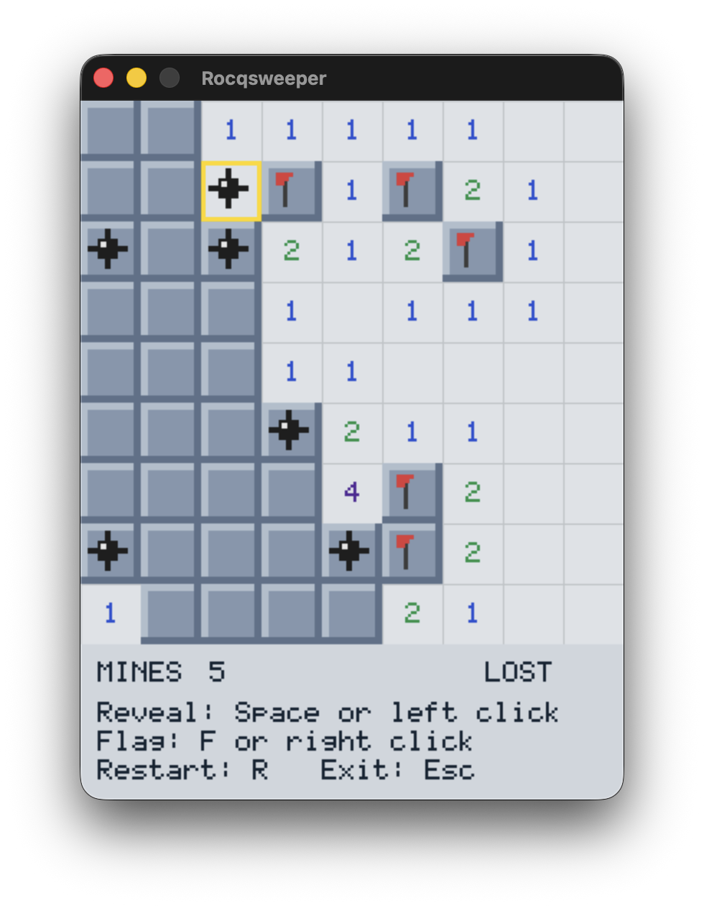

# Rocqsweeper

Rocqsweeper is a Minesweeper game written in Rocq and extracted to C++ with [Crane](https://github.com/bloomberg/crane). The game uses SDL2 for rendering, and small external audio players for sound playback.



## Features

- game logic written in Rocq
- extraction to C++ with Crane
- SDL2 rendering
- keyboard and mouse controls
- sound effects for revealing a mine, revealing a safe cell, and winning
- machine-checked proofs about the core game logic and the input layer

## Requirements

You need:

- Rocq with `dune`
- a C++23 compiler
- `pkg-config`
- SDL2
- SDL2_image

Runtime audio also needs a platform player in `PATH`:

- macOS: `afplay`
- Linux: one of `mpg123`, `ffplay`, or `play`

## Getting started

Clone the repo with everything it needs:

```bash
git clone --recurse-submodules https://github.com/joom/rocqsweeper.git
cd rocqsweeper
```

If you already cloned it without submodules, run:

```bash
git submodule update --init --recursive
```

## Installing dependencies

### macOS

Install the SDL packages with Homebrew:

```bash
brew install sdl2 sdl2_image
```

If you want to use Homebrew LLVM instead of the system toolchain:

```bash
brew install llvm
```

### Linux

The exact package names vary by distribution, but you generally need:

```bash
sudo apt install clang pkg-config libsdl2-dev libsdl2-image-dev
```

For sound playback, also install at least one of:

```bash
sudo apt install mpg123
```

or:

```bash
sudo apt install ffmpeg
```

or:

```bash
sudo apt install sox
```

## Building

Build the game:

```bash
make
```

This does four things:

1. uses the local Crane checkout in `./crane`
2. extracts [`theories/Rocqsweeper.v`](./theories/Rocqsweeper.v) and the SDL effect layer in [`theories/SDLDefs.v`](./theories/SDLDefs.v) and [`theories/SDL.v`](./theories/SDL.v) to C++
3. copies the generated C++ into `src/generated/`
4. compiles the final executable `./rocqsweeper`

Build with a different optimization level:

```bash
make OPT=-O2
```

## Running

Run the game:

```bash
make run
```

or:

```bash
./rocqsweeper
```

Controls:

- arrow keys or `WASD`: move cursor
- `Space`: reveal cell
- `F`: toggle flag
- left click: reveal cell
- right click: toggle flag
- `R`: restart
- `Q` or `Esc`: quit

## Cleaning

Remove build outputs:

```bash
make clean
```

This removes:

- `./rocqsweeper`
- `./src/generated/`
- `./rocqsweeper.dSYM`
- Dune build outputs

## Repository structure

```text
.
├── assets/
│   └── *.mp3                sound effects
├── crane/                   Crane submodule used for extraction
├── src/
│   ├── generated/           extracted C++ build artifacts
│   └── sdl_helpers.h        C++ SDL and audio helper functions
├── theories/
│   ├── GameProofs.v         proofs about the core Minesweeper rules
│   ├── InteractionProofs.v  proofs about cursor movement and event handling
│   ├── Rocqsweeper.v        game logic, rendering, sounds, extracted main loop
│   ├── SDLDefs.v            shared SDL effect definitions and smart constructors
│   ├── SDL.v                SDL extraction directives
│   └── dune                 Rocq theory stanza
├── Makefile                 extraction and native build entrypoint
├── dune-project             Dune project file
└── README.md
```

Generated files are written to:

```text
src/generated/
```

These are build artifacts and should not be edited manually.

## What Is Proved

The files [`theories/GameProofs.v`](./theories/GameProofs.v) and [`theories/InteractionProofs.v`](./theories/InteractionProofs.v) contain machine-checked proofs about the current game logic. At the moment, those proofs show that restarting returns the game to a clean blank board, first-click mine generation keeps the chosen starting cell safe, toggling a flag preserves mine placement and adjacency counts, the reveal flood-fill core preserves mine placement and does not increase the number of hidden safe cells, and pure gameplay traces preserve the main well-formedness and outcome invariants. They also prove that cursor updates stay within bounds, mouse actions outside the board are no-ops, mouse actions inside the board map to the expected reveal and flag operations, and restart and quit events are interpreted correctly by the event handler.

These proofs are about the actual Rocq implementation in [`theories/Rocqsweeper.v`](./theories/Rocqsweeper.v), not a separate paper model. They do not attempt to verify SDL itself or the extracted C++ runtime.

## Development notes

- The authoritative game logic lives in Rocq, not in the generated C++.
- The build expects Crane at [`crane/`](./crane).
- [`src/sdl_helpers.h`](./src/sdl_helpers.h) is the main handwritten C++ integration layer.
- The extracted program now defines its own `main`, so there is no separate handwritten `main.cpp`.
- If extraction succeeds but sound does not play on Linux, check that one of `mpg123`, `ffplay`, or `play` is installed.
